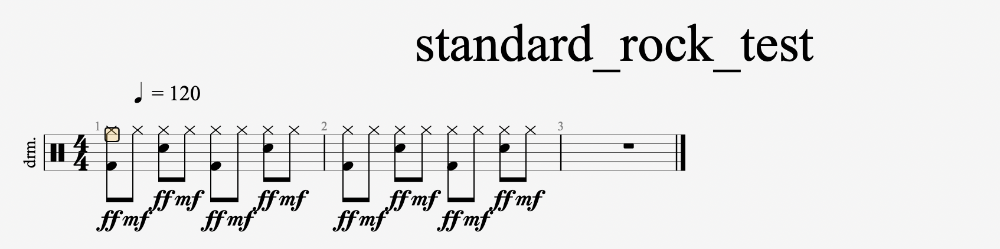
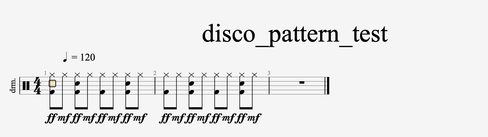
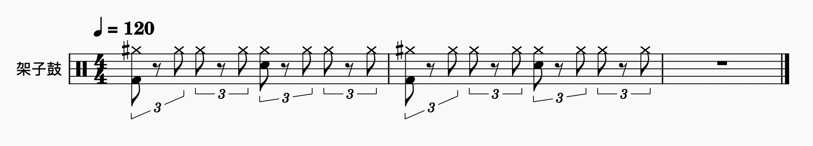
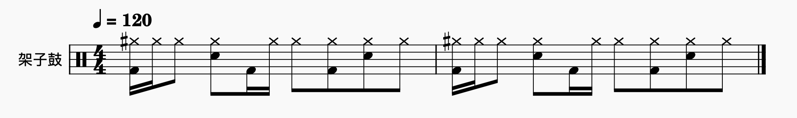
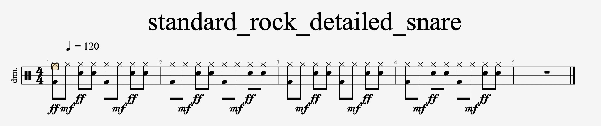
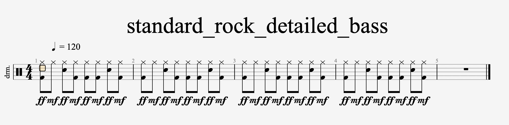
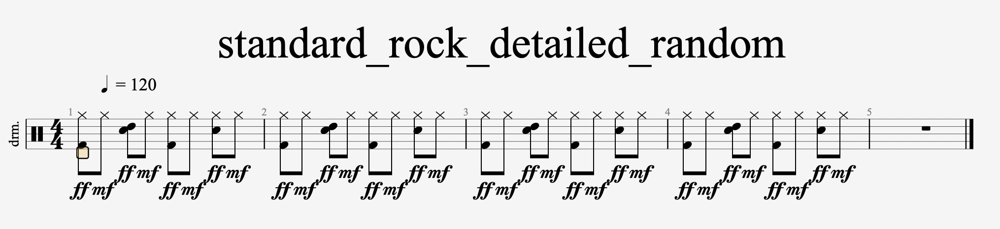

# CalMusiq - 架子鼓乐谱生成器

一个基于Python的智能架子鼓节奏型生成器，能够创建多种风格的架子鼓MIDI文件，支持节奏型变体和自定义参数。

## 功能特性

### 多种预定义节奏型
[rhythm_patterns.py](rhythm_patterns.py)

- **Standard Rock**
```
    def standard_rock():
        """标准摇滚节奏型 - 底鼓1、3拍，军鼓2、4拍"""
        return [
            {'beat': 1.0, 'drums': ['bass', 'closed_hihat'], 'accent': True},
            {'beat': 1.5, 'drums': ['closed_hihat'], 'accent': False},
            {'beat': 2.0, 'drums': ['snare', 'closed_hihat'], 'accent': True},
            {'beat': 2.5, 'drums': ['closed_hihat'], 'accent': False},
            {'beat': 3.0, 'drums': ['bass', 'closed_hihat'], 'accent': True},
            {'beat': 3.5, 'drums': ['closed_hihat'], 'accent': False},
            {'beat': 4.0, 'drums': ['snare', 'closed_hihat'], 'accent': True},
            {'beat': 4.5, 'drums': ['closed_hihat'], 'accent': False},
        ]
```



- **Disco**
```
    @staticmethod
    def disco_pattern():
        """迪斯科节奏型 - 四四拍每拍都有底鼓"""
        return [
            {'beat': 1.0, 'drums': ['bass', 'closed_hihat'], 'accent': True},
            {'beat': 1.5, 'drums': ['closed_hihat'], 'accent': False},
            {'beat': 2.0, 'drums': ['bass', 'snare', 'closed_hihat'], 'accent': True},
            {'beat': 2.5, 'drums': ['closed_hihat'], 'accent': False},
            {'beat': 3.0, 'drums': ['bass', 'closed_hihat'], 'accent': True},
            {'beat': 3.5, 'drums': ['closed_hihat'], 'accent': False},
            {'beat': 4.0, 'drums': ['bass', 'snare', 'closed_hihat'], 'accent': True},
            {'beat': 4.5, 'drums': ['closed_hihat'], 'accent': False},
        ]
```


- **Shuffle**
```
    @staticmethod
    def shuffle_pattern():
        """Shuffle节奏型 - 三连音感觉"""
        return [
            {'beat': 1.0, 'drums': ['bass', 'closed_hihat'], 'accent': True},
            {'beat': 1.67, 'drums': ['closed_hihat'], 'accent': False},  # 三连音的第二个音
            {'beat': 2.0, 'drums': ['closed_hihat'], 'accent': False},
            {'beat': 2.67, 'drums': ['closed_hihat'], 'accent': False},
            {'beat': 3.0, 'drums': ['snare', 'closed_hihat'], 'accent': True},
            {'beat': 3.67, 'drums': ['closed_hihat'], 'accent': False},
            {'beat': 4.0, 'drums': ['closed_hihat'], 'accent': False},
            {'beat': 4.67, 'drums': ['closed_hihat'], 'accent': False},
        ]
```


- **Funk** 
```
    def funk_pattern():
        """放克节奏型 - 强调切分和休止"""
        return [
            {'beat': 1.0, 'drums': ['bass', 'closed_hihat'], 'accent': True},
            {'beat': 1.25, 'drums': ['closed_hihat'], 'accent': False},  # 16分音符
            {'beat': 1.5, 'drums': ['closed_hihat'], 'accent': False},
            {'beat': 2.0, 'drums': ['snare', 'closed_hihat'], 'accent': True},
            {'beat': 2.5, 'drums': ['bass'], 'accent': False},
            {'beat': 2.75, 'drums': ['closed_hihat'], 'accent': False},
            {'beat': 3.0, 'drums': ['closed_hihat'], 'accent': False},
            {'beat': 3.5, 'drums': ['bass', 'closed_hihat'], 'accent': False},
            {'beat': 4.0, 'drums': ['snare', 'closed_hihat'], 'accent': True},
            {'beat': 4.5, 'drums': ['closed_hihat'], 'accent': False},
        ]
```


- **Ballad** 
- **Reggae** 
- ...
- 可自定义新增

### 🎵 智能变体生成
- **军鼓变体**: 随机添加军鼓音符

- **底鼓变体**: 随机添加底鼓音符

- **随机变体**: 智能增减音符

- **综合变体**: 结合多种变体技术


### ⚙️ 高度可配置
- 支持自定义BPM、拍号、小节数
- 可调节各种概率参数
- 支持重音和音量控制
- 三连音节奏支持

## 项目结构

```
calmusiq/
├── random_drumsheet.py      # 主要的架子鼓生成器类
├── rhythm_patterns.py       # 预定义节奏型模板
├── test_pattern_variants.py  # 测试脚本和使用示例
├── configs/                 # 配置文件目录
│   ├── midi_config.yaml     # MIDI音符映射配置
│   └── run_configs.yaml     # 运行参数配置
└── outputs/                 # 生成的MIDI文件输出目录
```

## 核心组件

### DrumSheetGenerator 类

主要的架子鼓乐谱生成器，提供以下核心功能：

#### 初始化和配置
```python
generator = DrumSheetGenerator(
    midi_config_path="./configs/midi_config.yaml",
    run_config_path="./configs/run_configs.yaml"
)
```

#### 节奏型生成
```python
# 从预定义模板生成
generator.generate_from_pattern(pattern, bars=4)

# 保存MIDI文件
generator.save_midi("output_filename.mid")
```

#### 变体创建
```python
# 创建不同类型的变体
snare_variant = generator.create_pattern_variant(pattern, 'snare')
bass_variant = generator.create_pattern_variant(pattern, 'bass')
random_variant = generator.create_pattern_variant(pattern, 'random')
all_variant = generator.create_pattern_variant(pattern, 'all')
```

### 主要方法说明

| 方法 | 功能 | 参数 |
|------|------|------|
| `generate_from_pattern()` | 根据节奏型模板生成MIDI | pattern, bars |
| `create_pattern_variant()` | 创建节奏型变体 | pattern, variant_type |
| `add_random_snare()` | 添加随机军鼓 | pattern, probability |
| `add_random_bass()` | 添加随机底鼓 | pattern, probability |
| `random_modify_notes()` | 随机增减音符 | pattern, add_prob, remove_prob |
| `save_midi()` | 保存MIDI文件 | filename |

## 快速开始

### 1. 基本使用

```python
from random_drumsheet import DrumSheetGenerator
from rhythm_patterns import RhythmPatterns

# 创建生成器
generator = DrumSheetGenerator()

# 获取标准摇滚节奏型
pattern = RhythmPatterns.standard_rock()

# 生成4小节的MIDI
generator.generate_from_pattern(pattern, bars=4)

# 保存文件
generator.save_midi("my_drum_beat.mid")
```

### 2. 创建变体

```python
# 创建军鼓变体
snare_variant = generator.create_pattern_variant(pattern, 'snare')
generator = DrumSheetGenerator()  # 重新初始化
generator.generate_from_pattern(snare_variant, bars=4)
generator.save_midi("snare_variant.mid")

# 创建综合变体
all_variant = generator.create_pattern_variant(pattern, 'all')
generator = DrumSheetGenerator()
generator.generate_from_pattern(all_variant, bars=4)
generator.save_midi("complex_variant.mid")
```

### 3. 自定义概率参数

```python
# 高军鼓概率变体
high_snare = generator.add_random_snare(pattern, probability=0.8)

# 高底鼓概率变体
high_bass = generator.add_random_bass(pattern, probability=0.8)

# 自定义增减音符概率
custom_variant = generator.random_modify_notes(
    pattern, 
    add_probability=0.2, 
    remove_probability=0.1
)
```

## 运行测试

项目包含完整的测试脚本，演示所有功能：

```bash
# 运行主程序（生成标准摇滚节奏型及其变体）
python random_drumsheet.py

# 运行完整测试（测试所有节奏型和变体功能）
python test_pattern_variants.py
```

### 测试功能包括：

1. **所有预定义节奏型测试** - 生成7种不同风格的节奏型
2. **特定变体功能测试** - 测试4种不同的变体类型
3. **自定义概率参数测试** - 测试不同概率设置的效果

## 配置文件

### midi_config.yaml
定义架子鼓各部件的MIDI音符映射：
```yaml
bass: 36          # 底鼓
snare: 38         # 军鼓
closed_hihat: 42  # 闭合踩镲
open_hihat: 46    # 开放踩镲
# ... 更多映射
```

### run_configs.yaml
定义运行参数：
```yaml
bpm: 120                    # 节拍速度
numerator: 4               # 拍号分子
denominator: 4             # 拍号分母
bars: 4                    # 小节数
output_path: "./outputs/"  # 输出路径
# ... 更多参数
```

## 技术特性

### 🎼 音乐理论支持
- 支持复杂拍号和节拍
- 三连音节奏精确处理
- 重音和音量动态控制
- 多声部同时演奏支持

### 🔧 代码特性
- 面向对象设计，易于扩展
- YAML配置文件，灵活可配
- 完整的错误处理
- 详细的中文注释

### 📁 输出格式
- 标准MIDI格式(.mid)
- 兼容主流DAW软件
- 保留完整的音符信息和时间精度

## 依赖库

- `music21` - 音乐理论和MIDI处理
- `PyYAML` - YAML配置文件解析
- `random` - 随机数生成
- `copy` - 深拷贝功能

## 安装依赖

```bash
pip install music21 PyYAML
```

## 使用场景

- 🎵 音乐制作和编曲
- 🥁 架子鼓练习伴奏
- 🎹 MIDI音序器素材
- 🎼 音乐教学演示
- 🔄 节奏型变体创作

## 扩展开发

### 添加新的节奏型
在 `rhythm_patterns.py` 中添加新的静态方法：

```python
@staticmethod
def your_new_pattern():
    return [
        {'beat': 1.0, 'drums': ['bass', 'closed_hihat'], 'accent': True},
        {'beat': 1.5, 'drums': ['closed_hihat'], 'accent': False},
        # ... 更多节拍定义
    ]
```

### 自定义变体算法
继承 `DrumSheetGenerator` 类并重写变体方法：

```python
class CustomDrumGenerator(DrumSheetGenerator):
    def custom_variant(self, pattern):
        # 实现自定义变体逻辑
        pass
```

## 许可证

本项目采用开源许可证，详见 LICENSE 文件。

---

**CalMusiq** - 让架子鼓节奏创作更简单、更智能！